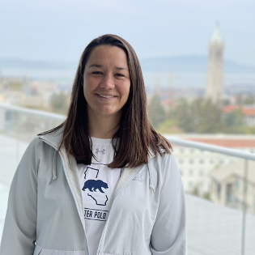
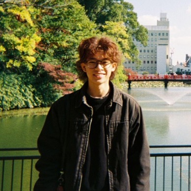
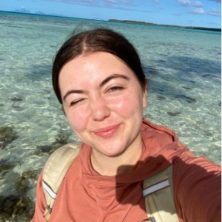

{fig-alt="A cartoon monster student in a backpack looks on at stunning gems labeled Touchstones of Intuition, which have the text You know some stuff written on sequential crystals." fig-align="center" width="70%" .lightbox}

::: {style="font-size: 90%; color: #787878;"}

Artwork by [@allison_horst](https://allisonhorst.com/)

:::

# Course description

Environmental scientists use data to understand the world around them. In this class, we'll learn about the tools used in environmental science and beyond to work with, analyze, and communicate about data. 

By the end of the quarter, students will be able to:  
1. Describe basic concepts of probability and statistics  
2. Identify appropriate statistical analyses to test hypotheses    
3. Conduct statistical analyses and visualize data using the R programming language  
4. Implement best practices for reproducible analysis and collaborative work  
5. Interpret and contextualize statistical results in general concepts from environmental studies  

# Teaching team

## Instructor

:::: {.columns}

::: {.column width="50%"}
{fig-align="center" width="80%"}
:::

::: {.column width="50%"}
**Name:** An Bui  
**Forms of address:** An (preferred), Dr. Bui, Professor Bui  
**Email:** an_bui [at] ucsb [dot] edu  
**Drop-in hours:** Thursdays 12:30 - 2:30 PM  
**Drop-in location:** At the tables outside the UCen 1st floor (facing the lagoon)  
**More about me:** [an-bui.com](https://an-bui.com/) 
:::

::::

## Teaching assistant

:::: {.columns}

::: {.column width="50%"}
{fig-align="center" width="80%"}
:::

::: {.column width="50%"}
**Name:** Allison Larko  
**Forms of address:** Allison  
**Email:** allisonlarko [at] ucsb [dot] edu  
**Drop-in hours:** Wednesdays 2:15 - 3:15 PM  
**Drop-in location:** Bren Hall, Deckers Terrace (2nd floor, outdoors,  facing the ocean)  
**More about me:** [LinkedIn](www.linkedin.com/in/allisonlarko) 
:::

::::

## Undergraduate learning assistants

:::: {.columns}

::: {.column width="50%"}
{fig-align="center" width="80%"}
:::

::: {.column width="50%"}
**Name:** Matthew Roco-Calvo  
**Forms of address:** Matt  
**Drop-in hours:** Fridays 10:50 - 11:50 AM  
**Drop-in location:** HSSB courtyard  
**More about me:** [LinkedIn](http://www.linkedin.com/in/matthewroco-calvo) 
:::

::::

:::: {.columns}

::: {.column width="50%"}

{fig-align="center" width="80%"}
:::

::: {.column width="50%"}
**Name:** Abigail Youngblood  
**Forms of address:** Abigail  
**Drop-in hours:** Wednesdays 4-5 PM  
**Drop-in location:** UCEN (tables in front of Subway)  
**More about me:** [LinkedIn](https://www.linkedin.com/in/abigail-d-youngblood/) 
:::

::::

### Acknowledgements

I took much of my inspiration for this course from Allison Horst's Environmental Data Science and Statistics course, Sam Sambado's Biometry course, and Sam Shanny-Csik's [Data Visualization and Communication course](https://eds-240-data-viz.github.io/).

